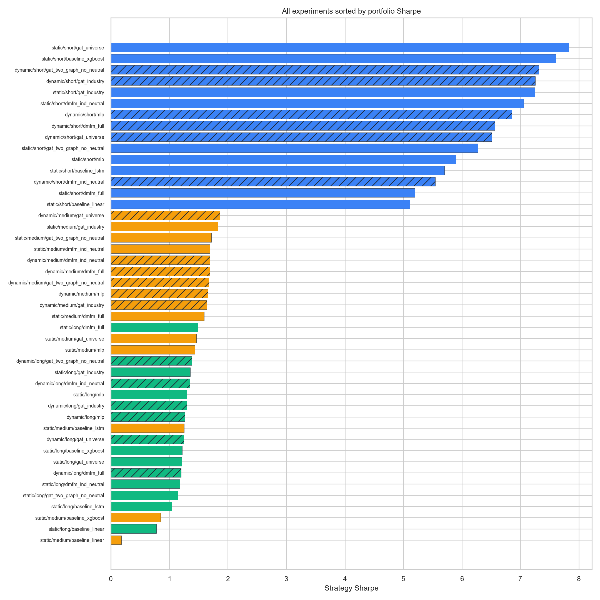
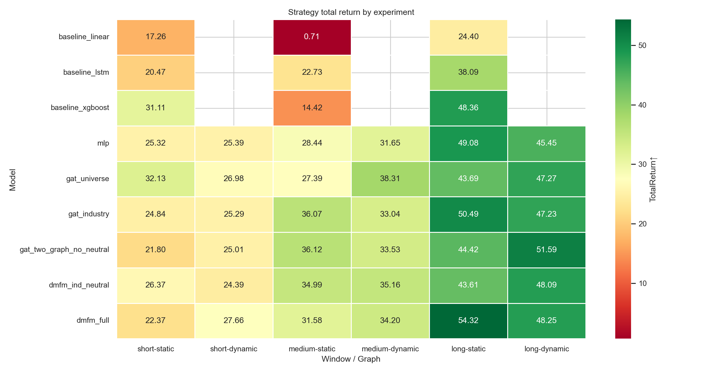
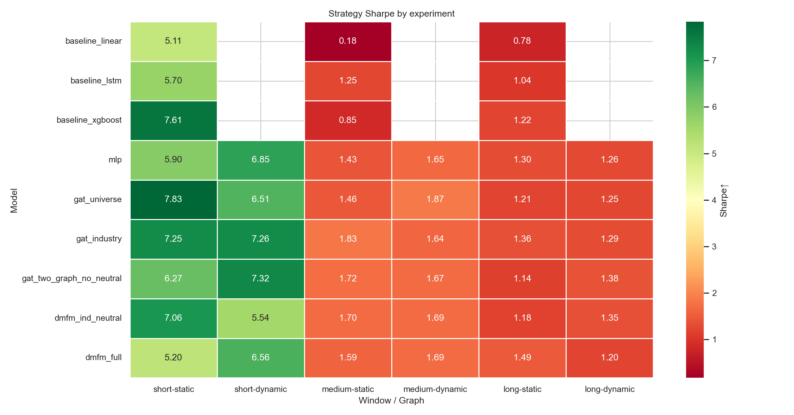
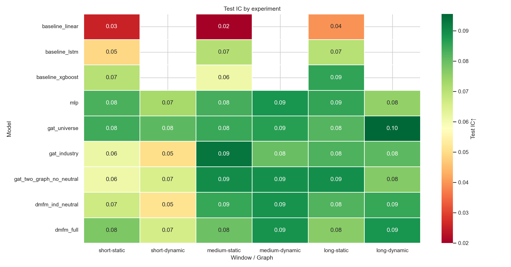
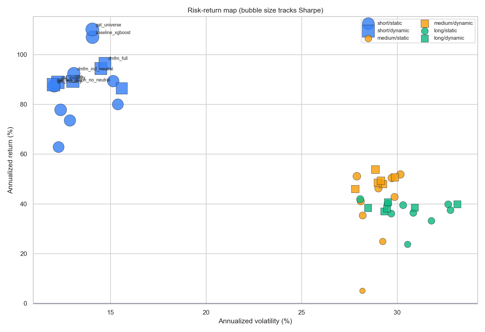
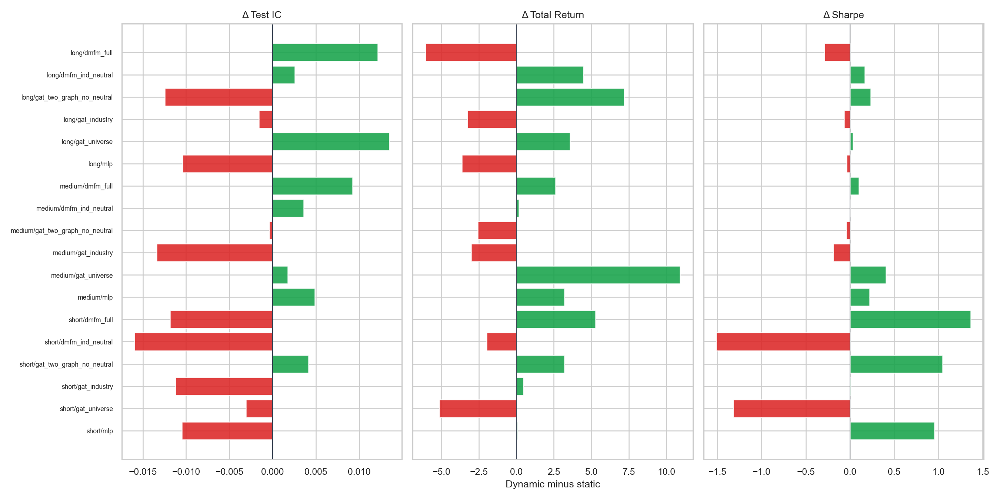
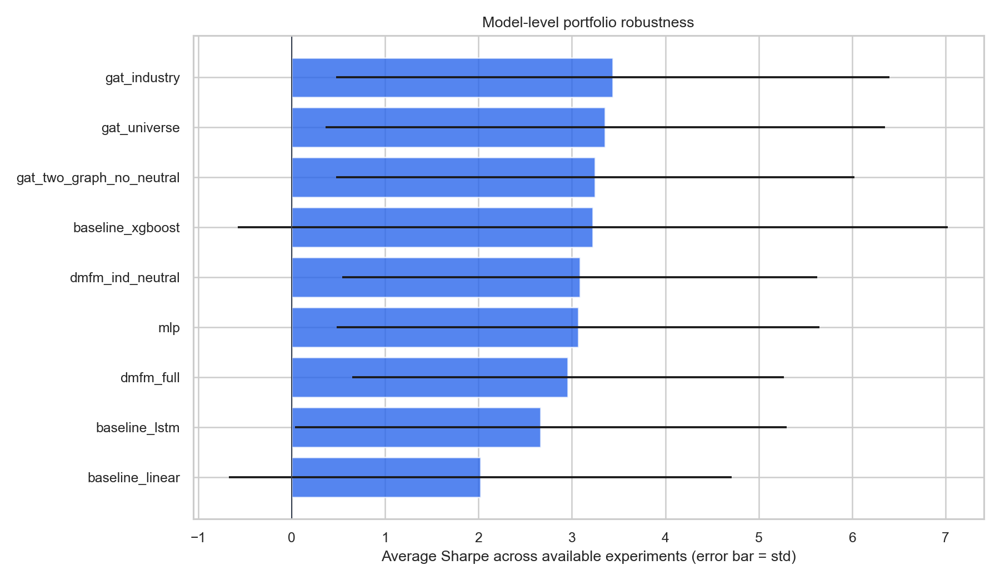
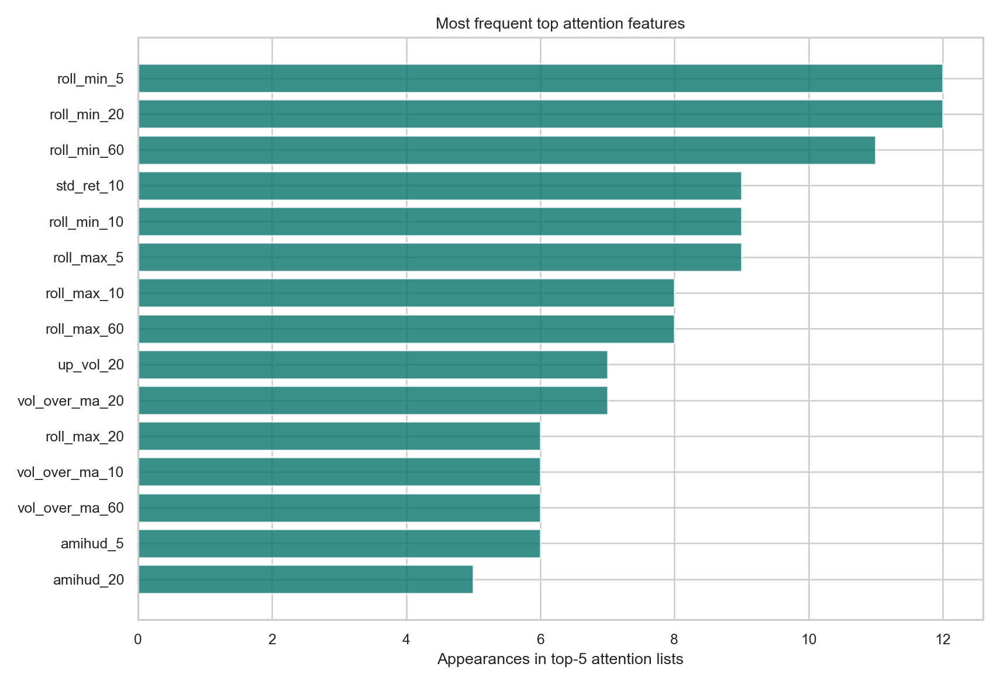

# runs_unified 實驗比較報告

- 資料來源：`/Users/luoyi/Desktop/gat_9_15/runs_unified`
- 產出時間：2026-05-03 00:53:17
- 實驗數：45；Graph modes：static, dynamic；Windows：short, medium, long
- 表格標記：`[BEST]` 代表該表格比較範圍內的最佳值；報酬/IC/Sharpe/HitRate/MaxDD 取最高，MSE/RMSE/MAE/Volatility/StdRet 取最低。
- 注意：`short`、`medium`、`long` 對應不同測試期間，所以跨 window 的數值只能看穩定性與情境差異；嚴格模型競賽應優先看同一 `window × graph_mode` 內的比較。

## 1. 視覺化總覽

## 2. 核心 insight

- 全域 portfolio Sharpe 最高是 `static/short/gat_universe`，Sharpe 7.832、Total Return 32.13%。
- 全域 Total Return 最高是 `static/long/dmfm_full`，Total Return 54.32%、Sharpe 1.490。
- Test IC 最高是 `dynamic/long/gat_universe`，IC 0.0955；Test MSE 最低是 `static/medium/gat_two_graph_no_neutral`，MSE 0.00250。這兩者若不是同一組，代表排序能力與點估計誤差不是同一件事。
- Dynamic graph 相對 static 的平均變化：Test IC -0.0022、Total Return +0.86pct、Sharpe +0.060。18 個可配對比較中，Sharpe 改善 10 組、Total Return 改善 11 組。
- Dynamic 的效果有期間差異，分 window 平均變化為 short: IC -0.0081, TR +0.31pct, Sharpe +0.091；medium: IC +0.0009, TR +1.88pct, Sharpe +0.082；long: IC +0.0006, TR +0.38pct, Sharpe +0.007。因此 dynamic graph 不是單向優勢，而是中期與部分長期組合較受益。
- 預測指標與投組指標的相關性：Test IC vs Sharpe = -0.305，DirAcc vs Sharpe = +0.098，MSE vs Sharpe = -0.207。若相關性不高，模型選擇應優先看投組層級排序，而不是只看 regression loss。
- `short` 測試窗 benchmark Sharpe 4.201、Total Return 20.97%；該窗最佳模型 `static/short/gat_universe` Sharpe 7.832、Total Return 32.13%。
- `medium` 測試窗 benchmark Sharpe -0.329、Total Return -7.49%；該窗最佳模型 `dynamic/medium/gat_universe` Sharpe 1.866、Total Return 38.31%。
- `long` 測試窗 benchmark Sharpe 0.625、Total Return 18.24%；該窗最佳模型 `static/long/dmfm_full` Sharpe 1.490、Total Return 54.32%。
- 跨可用實驗的模型穩定性：平均 Sharpe 最高為 `gat_industry` (3.438)；平均 Total Return 最高為 `dmfm_full` (36.40%)；平均 Test IC 最高為 `gat_universe` (0.0858)。這顯示沒有單一模型同時壟斷所有維度。
- Baseline 並非全被深度/圖模型碾壓；static 組內最佳 baseline 分別為 short: baseline_xgboost rank 2, Sharpe 7.608；medium: baseline_lstm rank 7, Sharpe 1.252；long: baseline_xgboost rank 4, Sharpe 1.218。但 `baseline_linear` 在三個 static window 都落在後段，主要是排序 IC 與投組報酬都偏弱。
- DMFM full 相對 industry-neutral 版本：平均 Total Return 差 +0.96pct，平均 Sharpe 差 -0.130，平均 Test IC 差 +0.0028；6 個配對中 full 的 IC 較高 4 次、Sharpe 較高 2 次。也就是 neutralization 對風險調整後報酬未必是劣勢，需按 window 判斷。
- Attention top features 最常出現的是 `roll_min_5`、`roll_min_20`、`roll_min_60`、`roll_max_5`、`std_ret_10`；訊號集中在 rolling min/max 與波動/成交量相關特徵，代表模型多半透過近期價格區間與風險狀態做排序。

## 3. Benchmark 與測試期間

| Window | Start | End | Periods | BenchTR | BenchSharpe | BenchAnnReturn | BenchAnnVol | BenchMaxDD |
| --- | --- | --- | --- | --- | --- | --- | --- | --- |
| short | 2020-09-30 | 2020-12-28 | 13 | **20.97% [BEST]** | **4.201 [BEST]** | **75.84% [BEST]** | **18.05% [BEST]** | **-3.41% [BEST]** |
| medium | 2022-05-16 | 2022-12-29 | 33 | -7.49% | -0.329 | -8.59% | 26.08% | -21.85% |
| long | 2024-07-04 | 2025-09-04 | 58 | 18.24% | 0.625 | 19.40% | 31.02% | -23.99% |

## 4. 每組 Winner 摘要

| Window | Graph | Models | Best TestIC | Best TotalReturn | Best Sharpe | Best ExcessTR |
| --- | --- | --- | --- | --- | --- | --- |
| short | static | 9 | gat_universe (0.0843) | gat_universe (32.13%) | gat_universe (7.832) | gat_universe (11.16%) |
| short | dynamic | 6 | gat_universe (0.0812) | dmfm_full (27.66%) | gat_two_graph_no_neutral (7.318) | dmfm_full (6.69%) |
| medium | static | 9 | gat_industry (0.0933) | gat_two_graph_no_neutral (36.12%) | gat_industry (1.832) | gat_two_graph_no_neutral (43.61%) |
| medium | dynamic | 6 | gat_two_graph_no_neutral (0.0893) | gat_universe (38.31%) | gat_universe (1.866) | gat_universe (45.79%) |
| long | static | 9 | gat_two_graph_no_neutral (0.0894) | dmfm_full (54.32%) | dmfm_full (1.490) | dmfm_full (36.09%) |
| long | dynamic | 6 | gat_universe (0.0955) | gat_two_graph_no_neutral (51.59%) | gat_two_graph_no_neutral (1.378) | gat_two_graph_no_neutral (33.36%) |

## 5. 全實驗重點總表

| Window | Graph | Model | Test IC↑ | DailyIC↑ | ICIR↑ | DirAcc↑ | TotalReturn↑ | CAGR↑ | Sharpe↑ | HitRate↑ | MaxDD↑ | ExcessTR↑ | ExcessSharpe↑ |
| --- | --- | --- | --- | --- | --- | --- | --- | --- | --- | --- | --- | --- | --- |
| short | static | gat_universe | 0.0843 | 0.0843 | 0.949 | 58.09% | 32.13% | **194.54% [BEST]** | **7.832 [BEST]** | **84.62% [BEST]** | -1.27% | 11.16% | **3.631 [BEST]** |
| short | static | baseline_xgboost | 0.0704 | 0.0695 | **1.044 [BEST]** | 52.70% | 31.11% | 185.77% | 7.608 | **84.62% [BEST]** | **-0.41% [BEST]** | 10.14% | 3.407 |
| short | static | gat_industry | 0.0613 | 0.0649 | 0.697 | 51.42% | 24.84% | 136.36% | 7.248 | **84.62% [BEST]** | -0.70% | 3.87% | 3.047 |
| short | static | dmfm_ind_neutral | 0.0670 | 0.0664 | 0.759 | 55.63% | 26.37% | 147.78% | 7.056 | 76.92% | -1.27% | 5.40% | 2.855 |
| short | static | gat_two_graph_no_neutral | 0.0612 | 0.0664 | 0.724 | 60.02% | 21.80% | 114.84% | 6.271 | 76.92% | -0.58% | 0.83% | 2.070 |
| short | static | mlp | 0.0830 | 0.0842 | 0.898 | 60.03% | 25.32% | 139.90% | 5.896 | 76.92% | -1.89% | 4.35% | 1.695 |
| short | static | baseline_lstm | 0.0491 | 0.0460 | 0.585 | 50.16% | 20.47% | 105.88% | 5.704 | **84.62% [BEST]** | -1.91% | -0.50% | 1.503 |
| short | static | dmfm_full | 0.0776 | 0.0776 | 0.969 | 40.00% | 22.37% | 118.75% | 5.196 | 76.92% | -2.64% | 1.40% | 0.995 |
| short | static | baseline_linear | 0.0255 | 0.0263 | 0.416 | 52.38% | 17.26% | 85.40% | 5.109 | 69.23% | -2.22% | -3.71% | 0.908 |
| short | dynamic | gat_two_graph_no_neutral | 0.0653 | 0.0656 | 0.802 | 60.03% | 25.01% | 137.62% | 7.318 | **84.62% [BEST]** | -1.22% | 4.04% | 3.117 |
| short | dynamic | gat_industry | 0.0501 | 0.0534 | 0.745 | 39.97% | 25.29% | 139.67% | 7.256 | 76.92% | -0.77% | 4.32% | 3.055 |
| short | dynamic | mlp | 0.0726 | 0.0741 | 0.775 | 60.02% | 25.39% | 140.41% | 6.850 | 76.92% | -1.53% | 4.42% | 2.649 |
| short | dynamic | dmfm_full | 0.0658 | 0.0687 | 0.723 | 39.98% | 27.66% | 157.71% | 6.563 | 76.92% | -0.85% | 6.69% | 2.362 |
| short | dynamic | gat_universe | 0.0812 | 0.0807 | 0.992 | **60.08% [BEST]** | 26.98% | 152.44% | 6.514 | 76.92% | -1.85% | 6.01% | 2.313 |
| short | dynamic | dmfm_ind_neutral | 0.0510 | 0.0479 | 0.571 | 57.70% | 24.39% | 133.08% | 5.544 | 76.92% | -1.52% | 3.42% | 1.343 |
| medium | static | gat_industry | 0.0933 | **0.0921 [BEST]** | 0.934 | 53.75% | 36.07% | 60.06% | 1.832 | 69.70% | -12.54% | 43.55% | 2.161 |
| medium | static | gat_two_graph_no_neutral | 0.0896 | 0.0896 | 0.773 | 54.91% | 36.12% | 60.16% | 1.717 | 69.70% | -13.35% | 43.61% | 2.047 |
| medium | static | dmfm_ind_neutral | 0.0850 | 0.0838 | 0.786 | 55.83% | 34.99% | 58.14% | 1.695 | 69.70% | -12.78% | 42.48% | 2.025 |
| medium | static | dmfm_full | 0.0794 | 0.0785 | 0.764 | 53.40% | 31.58% | 52.07% | 1.593 | 66.67% | -12.78% | 39.07% | 1.922 |
| medium | static | gat_universe | 0.0848 | 0.0839 | 0.904 | 55.49% | 27.39% | 44.73% | 1.459 | 66.67% | -12.64% | 34.87% | 1.788 |
| medium | static | mlp | 0.0835 | 0.0812 | 0.768 | 54.10% | 28.44% | 46.56% | 1.431 | 63.64% | -13.24% | 35.92% | 1.761 |
| medium | static | baseline_lstm | 0.0707 | 0.0676 | 0.579 | 53.90% | 22.73% | 36.72% | 1.252 | 60.61% | -13.70% | 30.21% | 1.581 |
| medium | static | baseline_xgboost | 0.0610 | 0.0611 | 0.486 | 52.14% | 14.42% | 22.84% | 0.849 | 66.67% | -15.48% | 21.90% | 1.179 |
| medium | static | baseline_linear | 0.0200 | 0.0160 | 0.132 | 50.82% | 0.71% | 1.08% | 0.178 | 63.64% | -16.63% | 8.19% | 0.507 |
| medium | dynamic | gat_universe | 0.0866 | 0.0867 | 0.854 | 55.77% | 38.31% | 64.10% | 1.866 | 69.70% | -11.70% | **45.79% [BEST]** | 2.196 |
| medium | dynamic | dmfm_ind_neutral | 0.0886 | 0.0879 | 0.904 | 46.01% | 35.16% | 58.43% | 1.695 | 63.64% | -13.17% | 42.64% | 2.024 |
| medium | dynamic | dmfm_full | 0.0887 | 0.0894 | 0.911 | 53.37% | 34.20% | 56.72% | 1.693 | 69.70% | -13.52% | 41.69% | 2.022 |
| medium | dynamic | gat_two_graph_no_neutral | 0.0893 | 0.0904 | 0.832 | 44.35% | 33.53% | 55.52% | 1.674 | 72.73% | -12.14% | 41.02% | 2.003 |
| medium | dynamic | mlp | 0.0884 | 0.0877 | 0.934 | 55.35% | 31.65% | 52.19% | 1.654 | 63.64% | -12.66% | 39.14% | 1.983 |
| medium | dynamic | gat_industry | 0.0799 | 0.0798 | 0.885 | 44.61% | 33.04% | 54.65% | 1.641 | 69.70% | -13.88% | 40.52% | 1.971 |
| long | static | dmfm_full | 0.0761 | 0.0754 | 0.929 | 52.90% | **54.32% [BEST]** | 45.79% | 1.490 | 63.79% | -20.40% | 36.09% | 0.865 |
| long | static | gat_industry | 0.0827 | 0.0819 | 0.822 | 55.83% | 50.49% | 42.64% | 1.358 | 68.97% | -21.68% | 32.25% | 0.733 |
| long | static | mlp | 0.0854 | 0.0845 | 0.836 | 43.89% | 49.08% | 41.48% | 1.302 | 65.52% | -21.73% | 30.84% | 0.677 |
| long | static | baseline_xgboost | 0.0856 | 0.0828 | 0.754 | 53.21% | 48.36% | 40.89% | 1.218 | 62.07% | -22.95% | 30.12% | 0.592 |
| long | static | gat_universe | 0.0821 | 0.0811 | 0.881 | 56.99% | 43.69% | 37.02% | 1.215 | 65.52% | -22.25% | 25.45% | 0.589 |
| long | static | dmfm_ind_neutral | 0.0825 | 0.0814 | 0.780 | 54.07% | 43.61% | 36.96% | 1.178 | 63.79% | -23.30% | 25.37% | 0.553 |
| long | static | gat_two_graph_no_neutral | 0.0894 | 0.0804 | 0.697 | 56.98% | 44.42% | 37.63% | 1.142 | 56.90% | -22.91% | 26.18% | 0.517 |
| long | static | baseline_lstm | 0.0704 | 0.0595 | 0.595 | 52.26% | 38.09% | 32.37% | 1.043 | 58.62% | -21.83% | 19.85% | 0.418 |
| long | static | baseline_linear | 0.0396 | 0.0346 | 0.366 | 50.92% | 24.40% | 20.89% | 0.775 | 58.62% | -22.29% | 6.16% | 0.150 |
| long | dynamic | gat_two_graph_no_neutral | 0.0769 | 0.0751 | 0.843 | 43.83% | 51.59% | 43.55% | 1.378 | 68.97% | -21.34% | 33.36% | 0.753 |
| long | dynamic | dmfm_ind_neutral | 0.0851 | 0.0849 | 0.912 | 54.79% | 48.09% | 40.66% | 1.347 | 67.24% | -21.63% | 29.85% | 0.721 |
| long | dynamic | gat_industry | 0.0811 | 0.0800 | 0.810 | 49.63% | 47.23% | 39.95% | 1.293 | 67.24% | -20.96% | 28.99% | 0.668 |
| long | dynamic | mlp | 0.0750 | 0.0741 | 0.872 | 50.36% | 45.45% | 38.48% | 1.262 | 65.52% | -21.21% | 27.21% | 0.637 |
| long | dynamic | gat_universe | **0.0955 [BEST]** | 0.0909 | 0.822 | 53.58% | 47.27% | 39.98% | 1.247 | 65.52% | -23.23% | 29.03% | 0.621 |
| long | dynamic | dmfm_full | 0.0883 | 0.0818 | 0.707 | 57.02% | 48.25% | 40.79% | 1.202 | 62.07% | -23.08% | 30.01% | 0.577 |

## 6. 同組詳細比較表

### short / static - Prediction metrics

| Model | Test MSE↓ | Test RMSE↓ | Test MAE↓ | Test IC↑ | DailyIC↑ | ICIR↑ | DirAcc↑ | IC_ind↑ | DailyIC_ind↑ | ICIR_ind↑ |
| --- | --- | --- | --- | --- | --- | --- | --- | --- | --- | --- |
| gat_universe | **0.00304 [BEST]** | **0.0552 [BEST]** | **0.0336 [BEST]** | **0.0843 [BEST]** | **0.0843 [BEST]** | 0.949 | 58.09% | **0.0825 [BEST]** | 0.0817 | 0.933 |
| baseline_xgboost | 0.00315 | 0.0561 | 0.0346 | 0.0704 | 0.0695 | **1.044 [BEST]** | 52.70% | - | - | - |
| gat_industry | 0.00305 | 0.0552 | 0.0338 | 0.0613 | 0.0649 | 0.697 | 51.42% | 0.0572 | 0.0604 | 0.637 |
| dmfm_ind_neutral | 0.00308 | 0.0555 | 0.0338 | 0.0670 | 0.0664 | 0.759 | 55.63% | 0.0632 | 0.0615 | 0.693 |
| gat_two_graph_no_neutral | 0.00511 | 0.0715 | 0.0517 | 0.0612 | 0.0664 | 0.724 | 60.02% | 0.0577 | 0.0635 | 0.664 |
| mlp | 0.00377 | 0.0614 | 0.0391 | 0.0830 | 0.0842 | 0.898 | **60.03% [BEST]** | 0.0806 | 0.0817 | 0.858 |
| baseline_lstm | 0.00315 | 0.0561 | 0.0352 | 0.0491 | 0.0460 | 0.585 | 50.16% | - | - | - |
| dmfm_full | 0.00490 | 0.0700 | 0.0577 | 0.0776 | 0.0776 | 0.969 | 40.00% | 0.0823 | **0.0828 [BEST]** | **1.004 [BEST]** |
| baseline_linear | 0.00308 | 0.0555 | 0.0340 | 0.0255 | 0.0263 | 0.416 | 52.38% | - | - | - |

### short / static - Portfolio metrics

| Model | N | TotalReturn↑ | CAGR↑ | AnnReturn↑ | AnnVol↓ | Sharpe↑ | HitRate↑ | MaxDD↑ | ExcessTR↑ | ExcessAnnRet↑ | ExcessSharpe↑ |
| --- | --- | --- | --- | --- | --- | --- | --- | --- | --- | --- | --- |
| gat_universe | 13 | **32.13% [BEST]** | **194.54% [BEST]** | **110.08% [BEST]** | 14.06% | **7.832 [BEST]** | **84.62% [BEST]** | -1.27% | **11.16% [BEST]** | **34.25% [BEST]** | **3.631 [BEST]** |
| baseline_xgboost | 13 | 31.11% | 185.77% | 106.99% | 14.06% | 7.608 | **84.62% [BEST]** | **-0.41% [BEST]** | 10.14% | 31.16% | 3.407 |
| gat_industry | 13 | 24.84% | 136.36% | 87.41% | **12.06% [BEST]** | 7.248 | **84.62% [BEST]** | -0.70% | 3.87% | 11.58% | 3.047 |
| dmfm_ind_neutral | 13 | 26.37% | 147.78% | 92.34% | 13.09% | 7.056 | 76.92% | -1.27% | 5.40% | 16.50% | 2.855 |
| gat_two_graph_no_neutral | 13 | 21.80% | 114.84% | 77.75% | 12.40% | 6.271 | 76.92% | -0.58% | 0.83% | 1.91% | 2.070 |
| mlp | 13 | 25.32% | 139.90% | 89.31% | 15.15% | 5.896 | 76.92% | -1.89% | 4.35% | 13.47% | 1.695 |
| baseline_lstm | 13 | 20.47% | 105.88% | 73.49% | 12.88% | 5.704 | **84.62% [BEST]** | -1.91% | -0.50% | -2.35% | 1.503 |
| dmfm_full | 13 | 22.37% | 118.75% | 79.96% | 15.39% | 5.196 | 76.92% | -2.64% | 1.40% | 4.13% | 0.995 |
| baseline_linear | 13 | 17.26% | 85.40% | 62.80% | 12.29% | 5.109 | 69.23% | -2.22% | -3.71% | -13.03% | 0.908 |

### short / dynamic - Prediction metrics

| Model | Test MSE↓ | Test RMSE↓ | Test MAE↓ | Test IC↑ | DailyIC↑ | ICIR↑ | DirAcc↑ | IC_ind↑ | DailyIC_ind↑ | ICIR_ind↑ |
| --- | --- | --- | --- | --- | --- | --- | --- | --- | --- | --- |
| gat_two_graph_no_neutral | 0.00359 | 0.0599 | 0.0371 | 0.0653 | 0.0656 | 0.802 | 60.03% | 0.0682 | 0.0677 | 0.843 |
| gat_industry | 0.00584 | 0.0764 | 0.0655 | 0.0501 | 0.0534 | 0.745 | 39.97% | 0.0454 | 0.0484 | 0.643 |
| mlp | 0.00455 | 0.0675 | 0.0468 | 0.0726 | 0.0741 | 0.775 | 60.02% | 0.0710 | 0.0723 | 0.748 |
| dmfm_full | 0.00607 | 0.0779 | 0.0669 | 0.0658 | 0.0687 | 0.723 | 39.98% | 0.0643 | 0.0673 | 0.684 |
| gat_universe | **0.00351 [BEST]** | **0.0592 [BEST]** | **0.0365 [BEST]** | **0.0812 [BEST]** | **0.0807 [BEST]** | **0.992 [BEST]** | **60.08% [BEST]** | **0.0803 [BEST]** | **0.0796 [BEST]** | **0.942 [BEST]** |
| dmfm_ind_neutral | 0.01120 | 0.1059 | 0.0757 | 0.0510 | 0.0479 | 0.571 | 57.70% | 0.0348 | 0.0331 | 0.430 |

### short / dynamic - Portfolio metrics

| Model | N | TotalReturn↑ | CAGR↑ | AnnReturn↑ | AnnVol↓ | Sharpe↑ | HitRate↑ | MaxDD↑ | ExcessTR↑ | ExcessAnnRet↑ | ExcessSharpe↑ |
| --- | --- | --- | --- | --- | --- | --- | --- | --- | --- | --- | --- |
| gat_two_graph_no_neutral | 13 | 25.01% | 137.62% | 87.95% | **12.02% [BEST]** | **7.318 [BEST]** | **84.62% [BEST]** | -1.22% | 4.04% | 12.12% | **3.117 [BEST]** |
| gat_industry | 13 | 25.29% | 139.67% | 88.85% | 12.25% | 7.256 | 76.92% | **-0.77% [BEST]** | 4.32% | 13.01% | 3.055 |
| mlp | 13 | 25.39% | 140.41% | 89.25% | 13.03% | 6.850 | 76.92% | -1.53% | 4.42% | 13.42% | 2.649 |
| dmfm_full | 13 | **27.66% [BEST]** | **157.71% [BEST]** | **96.53% [BEST]** | 14.71% | 6.563 | 76.92% | -0.85% | **6.69% [BEST]** | **20.70% [BEST]** | 2.362 |
| gat_universe | 13 | 26.98% | 152.44% | 94.41% | 14.49% | 6.514 | 76.92% | -1.85% | 6.01% | 18.57% | 2.313 |
| dmfm_ind_neutral | 13 | 24.39% | 133.08% | 86.43% | 15.59% | 5.544 | 76.92% | -1.52% | 3.42% | 10.59% | 1.343 |

### medium / static - Prediction metrics

| Model | Test MSE↓ | Test RMSE↓ | Test MAE↓ | Test IC↑ | DailyIC↑ | ICIR↑ | DirAcc↑ | IC_ind↑ | DailyIC_ind↑ | ICIR_ind↑ |
| --- | --- | --- | --- | --- | --- | --- | --- | --- | --- | --- |
| gat_industry | 0.00268 | 0.0518 | 0.0345 | **0.0933 [BEST]** | **0.0921 [BEST]** | **0.934 [BEST]** | 53.75% | 0.0976 | 0.0971 | **1.155 [BEST]** |
| gat_two_graph_no_neutral | **0.00250 [BEST]** | **0.0500 [BEST]** | **0.0330 [BEST]** | 0.0896 | 0.0896 | 0.773 | 54.91% | **0.0978 [BEST]** | **0.0972 [BEST]** | 1.014 |
| dmfm_ind_neutral | 0.00558 | 0.0747 | 0.0584 | 0.0850 | 0.0838 | 0.786 | **55.83% [BEST]** | 0.0926 | 0.0911 | 1.043 |
| dmfm_full | 0.01029 | 0.1014 | 0.0720 | 0.0794 | 0.0785 | 0.764 | 53.40% | 0.0844 | 0.0842 | 0.964 |
| gat_universe | 0.00321 | 0.0566 | 0.0388 | 0.0848 | 0.0839 | 0.904 | 55.49% | 0.0877 | 0.0866 | 0.984 |
| mlp | 0.00257 | 0.0507 | 0.0335 | 0.0835 | 0.0812 | 0.768 | 54.10% | 0.0855 | 0.0833 | 0.835 |
| baseline_lstm | 0.00254 | 0.0504 | 0.0335 | 0.0707 | 0.0676 | 0.579 | 53.90% | - | - | - |
| baseline_xgboost | 0.00255 | 0.0505 | 0.0337 | 0.0610 | 0.0611 | 0.486 | 52.14% | - | - | - |
| baseline_linear | 0.00253 | 0.0503 | 0.0335 | 0.0200 | 0.0160 | 0.132 | 50.82% | - | - | - |

### medium / static - Portfolio metrics

| Model | N | TotalReturn↑ | CAGR↑ | AnnReturn↑ | AnnVol↓ | Sharpe↑ | HitRate↑ | MaxDD↑ | ExcessTR↑ | ExcessAnnRet↑ | ExcessSharpe↑ |
| --- | --- | --- | --- | --- | --- | --- | --- | --- | --- | --- | --- |
| gat_industry | 33 | 36.07% | 60.06% | 51.08% | **27.89% [BEST]** | **1.832 [BEST]** | **69.70% [BEST]** | **-12.54% [BEST]** | 43.55% | 59.67% | **2.161 [BEST]** |
| gat_two_graph_no_neutral | 33 | **36.12% [BEST]** | **60.16% [BEST]** | **51.80% [BEST]** | 30.16% | 1.717 | **69.70% [BEST]** | -13.35% | **43.61% [BEST]** | **60.39% [BEST]** | 2.047 |
| dmfm_ind_neutral | 33 | 34.99% | 58.14% | 50.38% | 29.71% | 1.695 | **69.70% [BEST]** | -12.78% | 42.48% | 58.96% | 2.025 |
| dmfm_full | 33 | 31.58% | 52.07% | 46.22% | 29.01% | 1.593 | 66.67% | -12.78% | 39.07% | 54.81% | 1.922 |
| gat_universe | 33 | 27.39% | 44.73% | 40.99% | 28.09% | 1.459 | 66.67% | -12.64% | 34.87% | 49.58% | 1.788 |
| mlp | 33 | 28.44% | 46.56% | 42.74% | 29.86% | 1.431 | 63.64% | -13.24% | 35.92% | 51.33% | 1.761 |
| baseline_lstm | 33 | 22.73% | 36.72% | 35.29% | 28.19% | 1.252 | 60.61% | -13.70% | 30.21% | 43.88% | 1.581 |
| baseline_xgboost | 33 | 14.42% | 22.84% | 24.84% | 29.24% | 0.849 | 66.67% | -15.48% | 21.90% | 33.43% | 1.179 |
| baseline_linear | 33 | 0.71% | 1.08% | 5.01% | 28.18% | 0.178 | 63.64% | -16.63% | 8.19% | 13.60% | 0.507 |

### medium / dynamic - Prediction metrics

| Model | Test MSE↓ | Test RMSE↓ | Test MAE↓ | Test IC↑ | DailyIC↑ | ICIR↑ | DirAcc↑ | IC_ind↑ | DailyIC_ind↑ | ICIR_ind↑ |
| --- | --- | --- | --- | --- | --- | --- | --- | --- | --- | --- |
| gat_universe | **0.00268 [BEST]** | **0.0518 [BEST]** | **0.0341 [BEST]** | 0.0866 | 0.0867 | 0.854 | **55.77% [BEST]** | 0.0910 | 0.0895 | 0.977 |
| dmfm_ind_neutral | 0.00814 | 0.0902 | 0.0748 | 0.0886 | 0.0879 | 0.904 | 46.01% | 0.0913 | 0.0906 | 1.059 |
| dmfm_full | 0.00780 | 0.0883 | 0.0621 | 0.0887 | 0.0894 | 0.911 | 53.37% | 0.0918 | 0.0923 | **1.096 [BEST]** |
| gat_two_graph_no_neutral | 0.00946 | 0.0973 | 0.0889 | **0.0893 [BEST]** | **0.0904 [BEST]** | 0.832 | 44.35% | **0.0954 [BEST]** | **0.0947 [BEST]** | 1.066 |
| mlp | 0.00304 | 0.0551 | 0.0368 | 0.0884 | 0.0877 | **0.934 [BEST]** | 55.35% | 0.0913 | 0.0905 | 1.022 |
| gat_industry | 0.01089 | 0.1044 | 0.0939 | 0.0799 | 0.0798 | 0.885 | 44.61% | 0.0831 | 0.0834 | 1.063 |

### medium / dynamic - Portfolio metrics

| Model | N | TotalReturn↑ | CAGR↑ | AnnReturn↑ | AnnVol↓ | Sharpe↑ | HitRate↑ | MaxDD↑ | ExcessTR↑ | ExcessAnnRet↑ | ExcessSharpe↑ |
| --- | --- | --- | --- | --- | --- | --- | --- | --- | --- | --- | --- |
| gat_universe | 33 | **38.31% [BEST]** | **64.10% [BEST]** | **53.84% [BEST]** | 28.85% | **1.866 [BEST]** | 69.70% | **-11.70% [BEST]** | **45.79% [BEST]** | **62.42% [BEST]** | **2.196 [BEST]** |
| dmfm_ind_neutral | 33 | 35.16% | 58.43% | 50.62% | 29.87% | 1.695 | 63.64% | -13.17% | 42.64% | 59.21% | 2.024 |
| dmfm_full | 33 | 34.20% | 56.72% | 49.32% | 29.14% | 1.693 | 69.70% | -13.52% | 41.69% | 57.91% | 2.022 |
| gat_two_graph_no_neutral | 33 | 33.53% | 55.52% | 48.49% | 28.97% | 1.674 | **72.73% [BEST]** | -12.14% | 41.02% | 57.08% | 2.003 |
| mlp | 33 | 31.65% | 52.19% | 45.98% | **27.80% [BEST]** | 1.654 | 63.64% | -12.66% | 39.14% | 54.57% | 1.983 |
| gat_industry | 33 | 33.04% | 54.65% | 48.01% | 29.25% | 1.641 | 69.70% | -13.88% | 40.52% | 56.60% | 1.971 |

### long / static - Prediction metrics

| Model | Test MSE↓ | Test RMSE↓ | Test MAE↓ | Test IC↑ | DailyIC↑ | ICIR↑ | DirAcc↑ | IC_ind↑ | DailyIC_ind↑ | ICIR_ind↑ |
| --- | --- | --- | --- | --- | --- | --- | --- | --- | --- | --- |
| dmfm_full | 0.01819 | 0.1349 | 0.0905 | 0.0761 | 0.0754 | **0.929 [BEST]** | 52.90% | 0.0752 | 0.0745 | **0.979 [BEST]** |
| gat_industry | 0.00525 | 0.0725 | 0.0495 | 0.0827 | 0.0819 | 0.822 | 55.83% | 0.0829 | 0.0821 | 0.901 |
| mlp | 0.00615 | 0.0784 | 0.0643 | 0.0854 | **0.0845 [BEST]** | 0.836 | 43.89% | 0.0841 | **0.0830 [BEST]** | 0.860 |
| baseline_xgboost | **0.00309 [BEST]** | **0.0556 [BEST]** | **0.0358 [BEST]** | 0.0856 | 0.0828 | 0.754 | 53.21% | - | - | - |
| gat_universe | 0.01751 | 0.1323 | 0.1176 | 0.0821 | 0.0811 | 0.881 | **56.99% [BEST]** | 0.0816 | 0.0803 | 0.910 |
| dmfm_ind_neutral | 0.00511 | 0.0715 | 0.0464 | 0.0825 | 0.0814 | 0.780 | 54.07% | 0.0829 | 0.0818 | 0.852 |
| gat_two_graph_no_neutral | 0.00495 | 0.0704 | 0.0510 | **0.0894 [BEST]** | 0.0804 | 0.697 | 56.98% | **0.0869 [BEST]** | 0.0793 | 0.759 |
| baseline_lstm | 0.00312 | 0.0558 | 0.0361 | 0.0704 | 0.0595 | 0.595 | 52.26% | - | - | - |
| baseline_linear | 0.00310 | 0.0557 | 0.0359 | 0.0396 | 0.0346 | 0.366 | 50.92% | - | - | - |

### long / static - Portfolio metrics

| Model | N | TotalReturn↑ | CAGR↑ | AnnReturn↑ | AnnVol↓ | Sharpe↑ | HitRate↑ | MaxDD↑ | ExcessTR↑ | ExcessAnnRet↑ | ExcessSharpe↑ |
| --- | --- | --- | --- | --- | --- | --- | --- | --- | --- | --- | --- |
| dmfm_full | 58 | **54.32% [BEST]** | **45.79% [BEST]** | **41.82% [BEST]** | **28.06% [BEST]** | **1.490 [BEST]** | 63.79% | **-20.40% [BEST]** | **36.09% [BEST]** | **22.43% [BEST]** | **0.865 [BEST]** |
| gat_industry | 58 | 50.49% | 42.64% | 40.06% | 29.50% | 1.358 | **68.97% [BEST]** | -21.68% | 32.25% | 20.66% | 0.733 |
| mlp | 58 | 49.08% | 41.48% | 39.46% | 30.31% | 1.302 | 65.52% | -21.73% | 30.84% | 20.06% | 0.677 |
| baseline_xgboost | 58 | 48.36% | 40.89% | 39.78% | 32.66% | 1.218 | 62.07% | -22.95% | 30.12% | 20.38% | 0.592 |
| gat_universe | 58 | 43.69% | 37.02% | 36.06% | 29.69% | 1.215 | 65.52% | -22.25% | 25.45% | 16.66% | 0.589 |
| dmfm_ind_neutral | 58 | 43.61% | 36.96% | 36.33% | 30.84% | 1.178 | 63.79% | -23.30% | 25.37% | 16.94% | 0.553 |
| gat_two_graph_no_neutral | 58 | 44.42% | 37.63% | 37.44% | 32.78% | 1.142 | 56.90% | -22.91% | 26.18% | 18.04% | 0.517 |
| baseline_lstm | 58 | 38.09% | 32.37% | 33.15% | 31.79% | 1.043 | 58.62% | -21.83% | 19.85% | 13.75% | 0.418 |
| baseline_linear | 58 | 24.40% | 20.89% | 23.68% | 30.54% | 0.775 | 58.62% | -22.29% | 6.16% | 4.28% | 0.150 |

### long / dynamic - Prediction metrics

| Model | Test MSE↓ | Test RMSE↓ | Test MAE↓ | Test IC↑ | DailyIC↑ | ICIR↑ | DirAcc↑ | IC_ind↑ | DailyIC_ind↑ | ICIR_ind↑ |
| --- | --- | --- | --- | --- | --- | --- | --- | --- | --- | --- |
| gat_two_graph_no_neutral | 0.01528 | 0.1236 | 0.1075 | 0.0769 | 0.0751 | 0.843 | 43.83% | 0.0763 | 0.0749 | 0.943 |
| dmfm_ind_neutral | 0.00562 | 0.0749 | 0.0497 | 0.0851 | 0.0849 | **0.912 [BEST]** | 54.79% | 0.0838 | 0.0836 | **0.962 [BEST]** |
| gat_industry | 0.00438 | 0.0662 | 0.0446 | 0.0811 | 0.0800 | 0.810 | 49.63% | 0.0800 | 0.0793 | 0.885 |
| mlp | 0.01015 | 0.1008 | 0.0684 | 0.0750 | 0.0741 | 0.872 | 50.36% | 0.0738 | 0.0730 | 0.911 |
| gat_universe | **0.00318 [BEST]** | **0.0564 [BEST]** | **0.0364 [BEST]** | **0.0955 [BEST]** | **0.0909 [BEST]** | 0.822 | 53.58% | **0.0942 [BEST]** | **0.0898 [BEST]** | 0.876 |
| dmfm_full | 0.00517 | 0.0719 | 0.0519 | 0.0883 | 0.0818 | 0.707 | **57.02% [BEST]** | 0.0879 | 0.0819 | 0.794 |

### long / dynamic - Portfolio metrics

| Model | N | TotalReturn↑ | CAGR↑ | AnnReturn↑ | AnnVol↓ | Sharpe↑ | HitRate↑ | MaxDD↑ | ExcessTR↑ | ExcessAnnRet↑ | ExcessSharpe↑ |
| --- | --- | --- | --- | --- | --- | --- | --- | --- | --- | --- | --- |
| gat_two_graph_no_neutral | 58 | **51.59% [BEST]** | **43.55% [BEST]** | **40.68% [BEST]** | 29.51% | **1.378 [BEST]** | **68.97% [BEST]** | -21.34% | **33.36% [BEST]** | **21.28% [BEST]** | **0.753 [BEST]** |
| dmfm_ind_neutral | 58 | 48.09% | 40.66% | 38.34% | **28.47% [BEST]** | 1.347 | 67.24% | -21.63% | 29.85% | 18.95% | 0.721 |
| gat_industry | 58 | 47.23% | 39.95% | 38.09% | 29.46% | 1.293 | 67.24% | **-20.96% [BEST]** | 28.99% | 18.69% | 0.668 |
| mlp | 58 | 45.45% | 38.48% | 37.01% | 29.31% | 1.262 | 65.52% | -21.21% | 27.21% | 17.61% | 0.637 |
| gat_universe | 58 | 47.27% | 39.98% | 38.54% | 30.91% | 1.247 | 65.52% | -23.23% | 29.03% | 19.14% | 0.621 |
| dmfm_full | 58 | 48.25% | 40.79% | 39.85% | 33.14% | 1.202 | 62.07% | -23.08% | 30.01% | 20.45% | 0.577 |

## 7. Static vs Dynamic 配對差異

下表為同一 window、同一模型的 `dynamic - static`。正值代表 dynamic 較高；MaxDD 正值代表回撤較淺。

| Window | Model | Δ TestIC | Δ TotalReturn | Δ Sharpe | Δ MaxDD |
| --- | --- | --- | --- | --- | --- |
| short | mlp | -0.0105 | 0.07% | 0.954 | 0.36% |
| short | gat_universe | -0.0031 | -5.15% | -1.317 | -0.59% |
| short | gat_industry | -0.0112 | 0.45% | 0.008 | -0.07% |
| short | gat_two_graph_no_neutral | 0.0041 | 3.21% | 1.047 | -0.65% |
| short | dmfm_ind_neutral | -0.0159 | -1.98% | -1.512 | -0.25% |
| short | dmfm_full | -0.0118 | 5.28% | 1.367 | 1.79% |
| medium | mlp | 0.0049 | 3.21% | 0.222 | 0.58% |
| medium | gat_universe | 0.0017 | 10.92% | 0.407 | 0.94% |
| medium | gat_industry | -0.0134 | -3.03% | -0.190 | -1.35% |
| medium | gat_two_graph_no_neutral | -0.0004 | -2.59% | -0.044 | 1.21% |
| medium | dmfm_ind_neutral | 0.0036 | 0.16% | -0.001 | -0.39% |
| medium | dmfm_full | 0.0093 | 2.62% | 0.099 | -0.74% |
| long | mlp | -0.0104 | -3.63% | -0.040 | 0.52% |
| long | gat_universe | 0.0135 | 3.58% | 0.032 | -0.98% |
| long | gat_industry | -0.0016 | -3.26% | -0.065 | 0.72% |
| long | gat_two_graph_no_neutral | -0.0125 | 7.18% | 0.236 | 1.56% |
| long | dmfm_ind_neutral | 0.0025 | 4.47% | 0.169 | 1.67% |
| long | dmfm_full | 0.0122 | -6.07% | -0.288 | -2.68% |

## 8. 模型穩定性彙總

| Model | N | Group Wins | Avg Sharpe↑ | Median Sharpe↑ | Std Sharpe↓ | Avg TotalReturn↑ | Avg TestIC↑ | Avg DirAcc↑ |
| --- | --- | --- | --- | --- | --- | --- | --- | --- |
| gat_universe | 6 | 2 | 3.355 | 1.663 | 2.995 | 35.96% | **0.0858 [BEST]** | **56.67% [BEST]** |
| gat_two_graph_no_neutral | 6 | 2 | 3.250 | 1.695 | 2.773 | 35.41% | 0.0786 | 53.35% |
| gat_industry | 6 | 1 | **3.438 [BEST]** | **1.737 [BEST]** | 2.961 | 36.16% | 0.0747 | 49.20% |
| dmfm_full | 6 | 1 | 2.956 | 1.643 | **2.311 [BEST]** | **36.40% [BEST]** | 0.0793 | 49.45% |
| baseline_xgboost | 3 | 0 | 3.225 | 1.218 | 3.800 | 31.29% | 0.0724 | 52.68% |
| dmfm_ind_neutral | 6 | 0 | 3.086 | 1.695 | 2.543 | 35.44% | 0.0765 | 54.01% |
| mlp | 6 | 0 | 3.066 | 1.543 | 2.583 | 34.22% | 0.0813 | 53.96% |
| baseline_lstm | 3 | 0 | 2.666 | 1.252 | 2.633 | 27.10% | 0.0634 | 52.10% |
| baseline_linear | 3 | 0 | 2.021 | 0.775 | 2.691 | 14.12% | 0.0284 | 51.38% |

## 9. 指標相關性

| x | y | pearson_corr |
| --- | --- | --- |
| test_MSE | strategy_total_return | +0.427 |
| test_MSE | strategy_sharpe | -0.207 |
| test_MSE | excess_total_return | +0.255 |
| test_MSE | excess_sharpe | -0.224 |
| test_IC | strategy_total_return | +0.686 |
| test_IC | strategy_sharpe | -0.305 |
| test_IC | excess_total_return | +0.699 |
| test_IC | excess_sharpe | +0.045 |
| test_DailyIC | strategy_total_return | +0.641 |
| test_DailyIC | strategy_sharpe | -0.218 |
| test_DailyIC | excess_total_return | +0.666 |
| test_DailyIC | excess_sharpe | +0.143 |
| test_ICIR | strategy_total_return | +0.531 |
| test_ICIR | strategy_sharpe | +0.149 |
| test_ICIR | excess_total_return | +0.362 |
| test_ICIR | excess_sharpe | +0.355 |
| test_DirAcc | strategy_total_return | -0.018 |
| test_DirAcc | strategy_sharpe | +0.098 |
| test_DirAcc | excess_total_return | -0.058 |
| test_DirAcc | excess_sharpe | +0.103 |

## 10. Attention feature 彙總

| feature | appearances | mean_rank | mean_attention_weight | max_attention_weight |
| --- | --- | --- | --- | --- |
| roll_min_5 | 12 | 2.67 | 0.0261 | 0.0343 |
| roll_min_20 | 12 | 1.83 | 0.0259 | 0.0286 |
| roll_min_60 | 11 | 2.27 | 0.0256 | 0.0317 |
| std_ret_10 | 9 | 2.67 | 0.0265 | 0.0371 |
| roll_min_10 | 9 | 2.89 | 0.0257 | 0.0323 |
| roll_max_5 | 9 | 3.56 | 0.0249 | 0.0316 |
| roll_max_10 | 8 | 2.62 | 0.0265 | 0.0327 |
| roll_max_60 | 8 | 3.00 | 0.0242 | 0.0268 |
| up_vol_20 | 7 | 2.71 | 0.0286 | 0.0355 |
| vol_over_ma_20 | 7 | 3.29 | 0.0234 | 0.0273 |
| roll_max_20 | 6 | 2.83 | 0.0262 | 0.0337 |
| vol_over_ma_10 | 6 | 3.17 | 0.0253 | 0.0305 |
| vol_over_ma_60 | 6 | 3.50 | 0.0244 | 0.0256 |
| amihud_5 | 6 | 4.00 | 0.0238 | 0.0262 |
| amihud_20 | 5 | 2.80 | 0.0246 | 0.0270 |
| macd_signal | 5 | 4.40 | 0.0228 | 0.0253 |
| down_vol_20 | 4 | 2.75 | 0.0270 | 0.0329 |
| std_ret_20 | 4 | 2.75 | 0.0248 | 0.0278 |
| macd | 4 | 3.50 | 0.0226 | 0.0248 |
| ret_1 | 4 | 4.25 | 0.0224 | 0.0236 |

## 11. 輸出檔案

- `tables/all_experiments_flat.csv`：完整扁平化資料表
- `tables/comparison_key_metrics.csv`：主要比較欄位
- `tables/group_winners.csv`：每個 `window × graph_mode` 的 winner
- `tables/dynamic_minus_static_deltas.csv`：static/dynamic 配對差異
- `tables/metric_correlations.csv`：主要預測指標與投組指標的 Pearson correlation
- `tables/attention_top_features.csv`、`tables/attention_feature_summary.csv`：attention 特徵彙總
